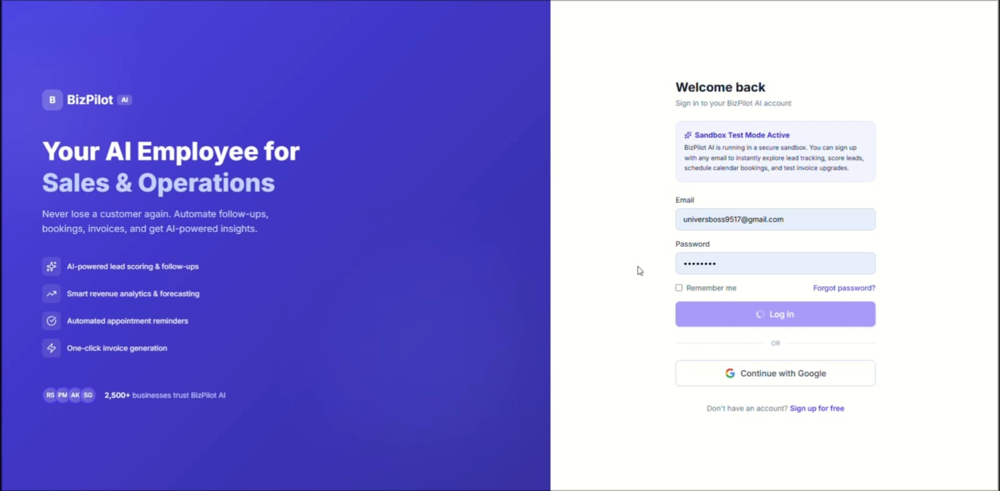
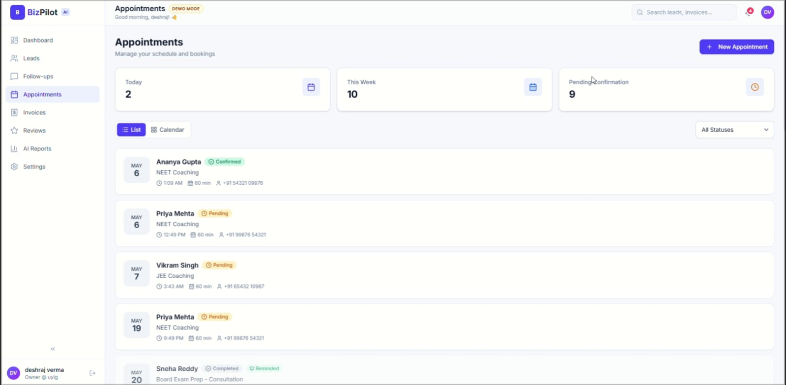
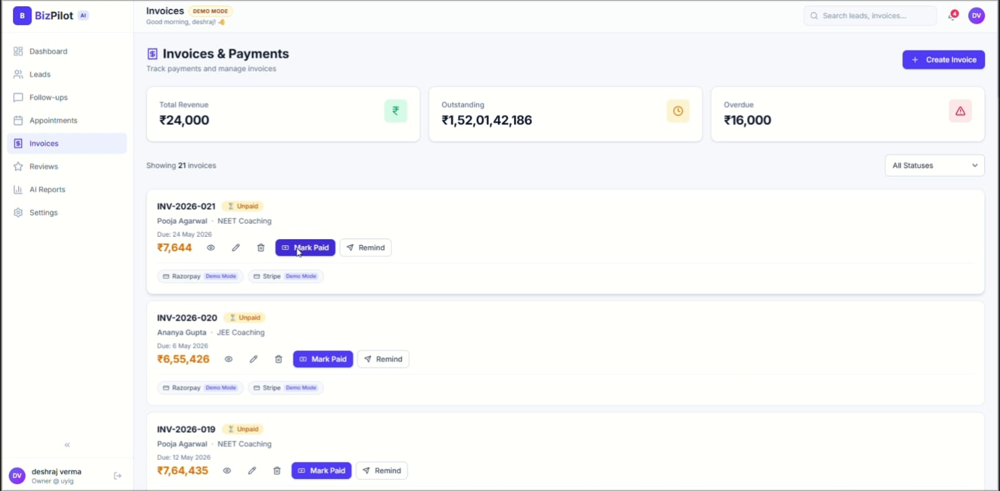
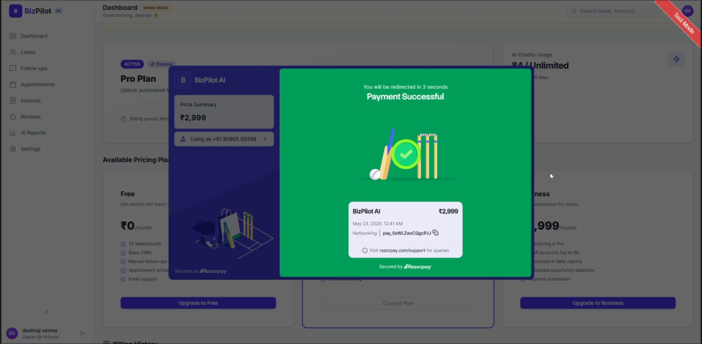

# BizPilot AI

**Automate Leads, Bookings & Payments with AI Operations**

🔗 **Live Demo:** [https://bizpilot-ai-ten.vercel.app](https://bizpilot-ai-ten.vercel.app)

BizPilot AI is a modern, unified business operations platform designed specifically for local service businesses (such as tutoring centers, salons, cleaning agencies, and local contractors). It consolidates critical administrative workflows—lead tracking, calendar scheduling, invoice collection, and testimonial feedback—into a single responsive SaaS dashboard.

---

## 📸 Screenshots

| Landing Page Hero | Owner Analytics Dashboard |
|---|---|
|  |  |

| Lead CRM & Detail Panel | Razorpay Checkout (Test Mode) |
|---|---|
|  |  |

---

## ⚡ Key Features

1. **Operations Landing Page**: A visually premium marketing showcase highlighting the core product suites, use cases by business type, FAQs, and subscription plans, connected directly to legal disclaimers.
2. **Interactive Onboarding Wizard**: A step-by-step interactive business configuration setup (saving preferences, payment methods, working hours, and goals) with stateful persistence.
3. **Owner Dashboard**: At-a-glance analytics showing outstanding invoices, conversion rates, upcoming appointments, and recent leads, paired with a dynamic SQL-driven revenue trends chart.
4. **Lead CRM**: Full-featured CRM to view, search, and filter client leads. View individual lead detail pages with action histories, timeline logs, and custom AI follow-up message generators.
5. **AI Follow-up Messages**: Generates customized follow-up text using custom tones (Professional, Friendly, Hinglish, Short, or Persuasive) ready for WhatsApp, SMS, or email.
6. **Appointment Scheduler**: Organized weekly and daily calendar views to schedule client bookings, track reminders, and manage appointment states (Pending, Confirmed, Cancelled, Completed).
7. **Automated Invoices**: Create, track, and filter invoices, with automatic status badges (`Paid`, `Unpaid`, `Overdue`) and local UPI payment link generators.
8. **Testimonial Pipeline**: A feedback management interface. Submitting a review rating and comment updates the Supabase record and dynamically renders the new review onto the public landing page testimonials grid.
9. **Real-time Reports**: Non-technical summary reports calculating leads acquired, conversion rates, outstanding balances, and monthly growth rates.
10. **Billing & Subscriptions**: Simulated subscription plan tiers allowing users to trigger a Razorpay Test Mode checkout and track transaction histories.
11. **Mobile Responsive**: Fully optimized bottom-bar navigation and drawer modal overlays for modern mobile and tablet viewports.

---

## 🛠️ Tech Stack

* **Frontend Framework**: [Next.js 15](https://nextjs.org/) (App Router, Turbopack, React 19)
* **Programming Language**: TypeScript
* **Database & Auth**: [Supabase](https://supabase.com/) (PostgreSQL & Supabase Auth)
* **Simulated Payments**: [Razorpay API](https://razorpay.com/) (Test Mode Checkout & Verifications)
* **Styling & Theme**: TailwindCSS v4 with custom HSL theme tokens and micro-animations
* **Icons**: Lucide React
* **Charts & Visuals**: Recharts (fully responsive canvas overlays)

---

## 🔒 Production Safety & Security Notes

BizPilot AI is architected with modern SaaS security standards:
* **Row-Level Security (RLS)**: Public access to database tables is revoked. PostgreSQL policies ensure that authenticated sessions can only perform SELECT, INSERT, UPDATE, or DELETE queries on records where `auth.uid() = user_id`.
* **Cryptographic Signatures**: The payment verification API computes a secure `HMAC-SHA256` signature using the private merchant secret to validate Razorpay checkout tokens server-side, preventing client-side spoofing.
* **Referential Integrity**: Cascading foreign keys (`ON DELETE SET NULL`) ensure that deleting a lead preserves historical invoices and appointment logs for accounting purposes.
* **Resilient SDK Script Loading**: The Razorpay SDK script injection handles 10-second network timeouts gracefully, cleaning up appended scripts and reverting checkout loaders on failure.
* **Zero-State Integrity**: Graph calculations and metrics fall back gracefully to a zero-state if no paid invoices or leads are registered in the database, avoiding divide-by-zero crashes.

---

## 💻 Developer Setup & Installation

### Prerequisites
Make sure you have Node.js (version 18+ recommended) and `npm` installed.

### Steps
1. **Clone the repository and install dependencies**:
   ```bash
   npm install
   ```

2. **Configure Environment Variables**:
   Copy `.env.example` to `.env.local` at the root of the project:
   ```bash
   cp .env.example .env.local
   ```
   Open `.env.local` and configure your API keys:
   ```env
   NEXT_PUBLIC_SUPABASE_URL=your-supabase-project-url
   NEXT_PUBLIC_SUPABASE_ANON_KEY=your-supabase-anon-key
   NEXT_PUBLIC_RAZORPAY_KEY_ID=your-razorpay-key-id
   RAZORPAY_KEY_SECRET=your-razorpay-key-secret
   RAZORPAY_WEBHOOK_SECRET=your-razorpay-webhook-secret
   ```

3. **Run Development Server**:
   ```bash
   npm run dev
   ```
   Open [http://localhost:3000](http://localhost:3000) in your browser.

4. **Verify Type Checks and Production Build**:
   ```bash
   npx tsc --noEmit
   npm run build
   ```

---

## ⚙️ Current Status
This application is configured as a **production-ready showcase**:
* **Database & Auth**: Live (requires configuring Supabase keys).
* **Payment Processing**: Configured for **Razorpay Test Mode** only. No actual financial transactions take place.
* **AI Features**: Message text generation is simulated locally using client-side helper models.
